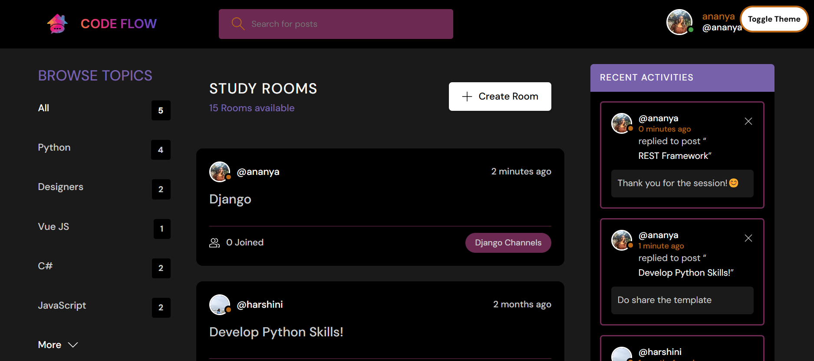
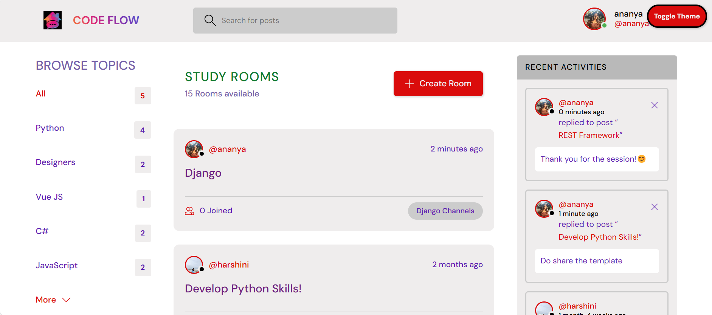
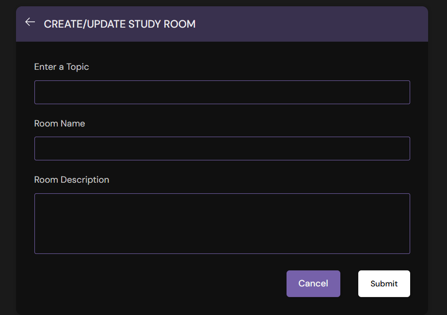

# 🏠 Django Chat Room Application

A web-based platform designed for seamless, instant communication, enabling real-time messaging and user interactions. This project is developed using Django and focuses on performance, scalability, and ease of use. The architecture is designed to handle multiple concurrent users efficiently, making it ideal for dynamic and interactive communication.

---

## ✨ Features
- 🚀 **Real-Time Communication**: Instant messaging for live discussions.
- 👥 **Group Interaction**: Multiple users can engage in group chats simultaneously.
- 🔐 **User Authentication**: Secure login and account management for personalized experiences.
- 🛡 **Privacy Options**: Private messaging features for one-on-one conversations.
- 📈 **Scalability**: Designed to handle multiple users efficiently.
- 🎨 **Customizable Profiles**: Users can personalize their accounts and settings.
- 🛠 **Security**: Includes form validation and custom error handling for enhanced safety.

---

## 🛠 Technologies Used
- 🎨 **Frontend**: HTML, CSS, Bootstrap, JavaScript
- ⚙ **Backend**: Django, Django Channels
- 🗄 **Database**: SQLite


## ⚙ Installation

### 📥 Cloning the Repository
Clone the repository using the command below:
```sh
git clone https://github.com/Ananyashetty7/Chat-Room
```
Move into the directory where we have the project files:
```sh
cd Chat-Room
```

### 🏗 Creating a Virtual Environment
Let's install virtualenv first:
```sh
pip install virtualenv
```
Then we create our virtual environment:
```sh
virtualenv envname
```

### 🚀 Activating the Virtual Environment
#### On Windows:
```sh
envname\Scripts\activate
```
#### On macOS/Linux:
```sh
source envname/bin/activate
```

### 📦 Installing Dependencies
Install the requirements:
```sh
pip install -r requirements.txt
```

---

## ▶ Running the App
To run the App, use:
```sh
python manage.py runserver
```
⚠ Then, the development server will be started at: [http://127.0.0.1:8000/](http://127.0.0.1:8000/)

---

## 👥 Project Team
**🚀 Project Head:** Ananya G Shetty

---

## 📸 Screenshots
### 🏡 Home Page



### 💬 Chat Room


### 🔑 Login Page


### ➕ Create Room Page


---

